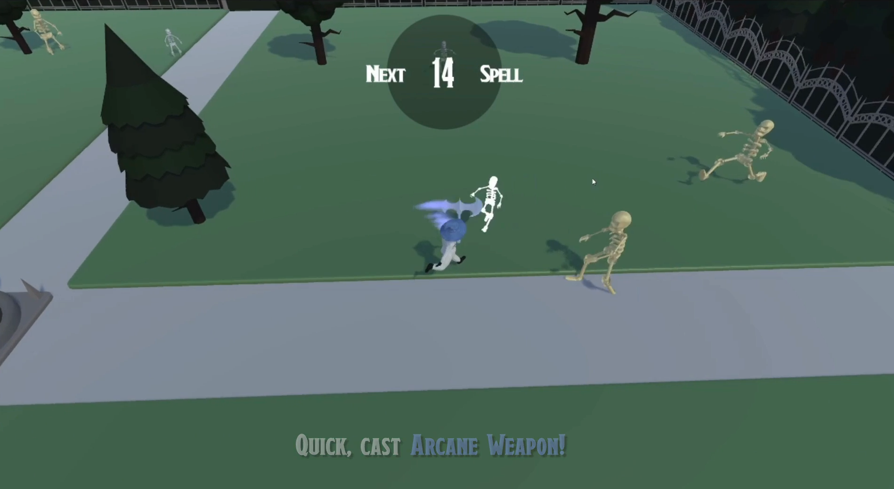
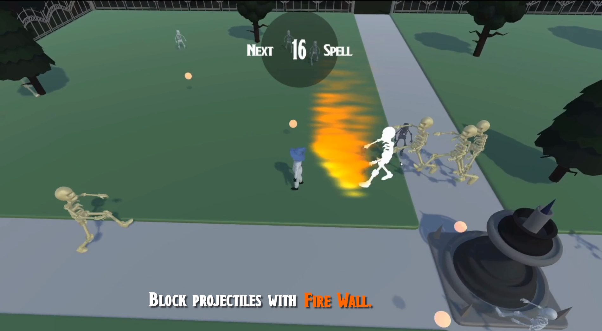
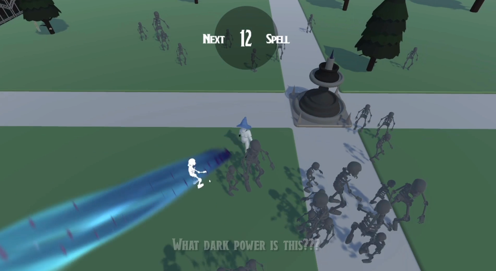

# Balthazar's Final Exam (Climax Game Jam 2024)

  

Balthazar's Final Exam was the product of a 48 hour game jam (5th April to the 7th April 2024), with the 
goal to raise money for the charity [Mind](https://www.mind.org.uk/), hosted by [Climax Studios](https://www.climaxstudios.com/). 

The idea being that a clumsy wizard (named Balthazar) has been unable to pass his exam of wizardry, 
and has one last chance to succeed. 

The jam's theme was 'periodic', which was integrated into the game by having the spells that Balthazar 
casts change after a short time interval. In theory, these spells could be extremely powerful, to downright 
annoying to the player. Within the game there are 4 spells:  

   (1) <b>Arcane Weapon</b> (user presses left-mouse to swing an etherial axe), 
   (2) <b>Fire Wall</b> (user moves the mouse to change the facing-direction of a huge wall of fire), 
   (3) <b>Eldritch Blast</b> (user moves the mouse to change the facing-direction of an insta-kill beam). 
   (4) <b>Invisibility</b> (all enemies turn invisible). 
   
Made in the Unity game engine.  
Submitted to the Climax Game Jam (2024).  

You can play the submitted game - [here.](https://brandonmooney.itch.io/balthazars-final-exam)  

# Current Video Demonstration
[Balthazar's Final Exam: Project Submission Video Demo](https://drive.google.com/file/d/1GnnQ83DrNdoaqV2Jl5670KyFtg1eKr6d/view?usp=sharing)  

# Contributions:
Special thanks to my team mates who made this game possible:

[<b>Brandon Mooney</b> - Programmer/VFX](https://www.linkedin.com/in/brandon-mooney-b2b979282/) 
[<b>Ellie Oliver</b> - Artist](https://www.instagram.com/ellie_mj_oliver/)  
[<b>Elin Rafferty </b> - UI/Audio](https://www.linkedin.com/in/elin-rafferty?) 
